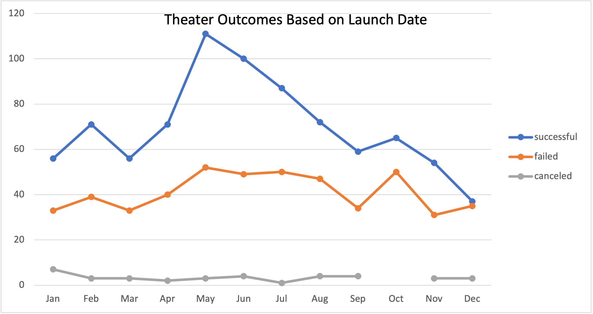
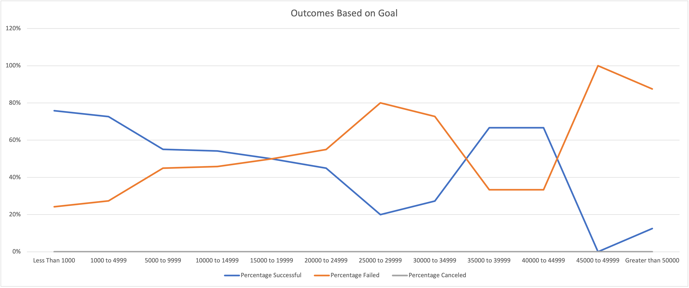

# An Analysis of Kickstarter Campaigns
## Overview of Project
### Performing analysis of Kickstarter data to uncover trend, and giving a better view of how project outcomes impacted by time, funding, etc.
## Analysis and Challenges
### Analysis of Outcomes Based on Launch Date
By using **pivot table**, this chart counted how many campaigns were successful, failed and canceled in launched each month through out the year, filtered by theater category. Found out, in this categoty, the trend of how campaigns fared in the different period/season of the year. There is also a filter for Years which was the year extract from the Launch date by `YEAR()` function. Filtering by different year, you may also look up how trends look like in between years.

### Analysis of Outcomes Based on Goals
Analyse how many campaigns were successful, failed and canceled in different goal amount interval by using `COUNTIFS()` function. Found out how likely that the Goal of fund in relation with the outcomes of the campaigns by calculate the percentage of different outcomes in each interval.

### Challenges and Difficulties Encountered 
To having a closer view of Louis' campaign, we filtered subcategory, play, from filtered theater data. As filtering the data, we also narrowed the whole dataset in a smaller size, which may causing the analysis not cover enough data for uncovering the trend. Besides, the two analysis of outcomes is containing different datasets, which is possible that the results of them may present slightly different in trend.
## Results
### Conclusion about Theater Outcomes by Launch Date
- For Theater category, successful kickstarters are more launched at May, June, and July.
- For Theater category, numbers of failed kickstarters are steady through out the year. Also, there was next to nothing counted as canceled project through out the years.
### Conclusion about Outcomes based on Goals
- Under subcategory "play", is more likely that when goal of the campaign is less than 25000, or in between 35000 to 45000, the outcome is successful.
### Limitations
- This dataset may not represent all professional campaigns in Thearter/play category which is Louis is currently working on. Besides, there are no data on the 2019-2020 which is closer to current; and, economy market trend may change during these years but we cannot tell from this dataset. What's more, details of project management and heat of topic may also produce effect on the outcomes, which are not included in this dataset. 
### Recommendation
- Creat an addtional table for the statistics calculation. Finding out the Central Tendency, Spread and outliers. Then, visualizing the distributions by the box and whisker chart. Finding out if there is any outlier.
